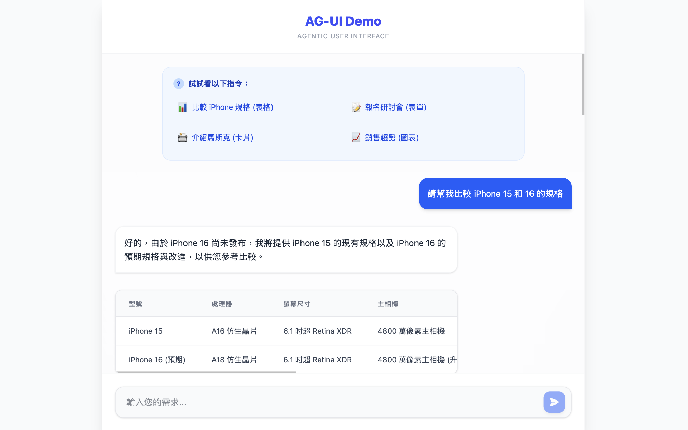

# AG-UI Demo 專案 (Agentic User Interface)



這是一個展示 AG-UI (Agentic User Interface) 概念的 Demo 專案。
它演示了如何讓 AI Agent (Gemini) 根據對話內容，動態決定並渲染最適合的前端 UI 元件（如表格、表單、卡片等），而不僅僅是輸出文字。

本專案不依賴 CopilotKit，而是手動實作了 AG-UI 的協定與事件串流機制。

## 功能特色

*   動態 UI 渲染：Agent 可根據意圖回傳 update_ui 事件，前端即時渲染對應元件。
*   Gemini 驅動：後端整合 Google Gemini 模型，具備真實的語意理解能力。
*   串流回應 (Streaming)：支援打字機效果的文字串流與即時 UI 更新。
*   現代化介面：使用 React + Tailwind CSS 打造的精美聊天介面。

## 技術堆疊

*   Frontend: React, TypeScript, Tailwind CSS (v4), Vite
*   Backend: Python, FastAPI, Google Generative AI SDK

## 快速開始

### 1. 環境準備

確保您的系統已安裝：
*   Node.js (v20+)
*   Python (v3.10+)
*   Google Gemini API Key

### 2. 後端設定 (Backend)

1.  進入後端目錄：
    ```bash
    cd backend
    ```

2.  建立虛擬環境 (建議)：
    ```bash
    python -m venv venv
    source venv/bin/activate  # Mac/Linux
    # venv\Scripts\activate   # Windows
    ```

3.  安裝依賴套件：
    ```bash
    pip install -r requirements.txt
    ```

4.  設定環境變數：
    複製 .env.example 為 .env，並填入您的 API Key。
    ```bash
    cp .env.example .env
    ```
    編輯 .env 檔案：
    ```env
    GEMINI_API_KEY=您的_GEMINI_API_KEY
    ```

5.  啟動後端伺服器：
    ```bash
    uvicorn main:app --reload --port 8000
    ```
    後端將運行於 http://localhost:8000。

### 3. 前端設定 (Frontend)

1.  開啟新的終端機視窗，進入前端目錄：
    ```bash
    cd frontend
    ```

2.  安裝依賴套件：
    ```bash
    npm install
    ```

3.  啟動開發伺服器：
    ```bash
    npm run dev
    ```
    前端將運行於 http://localhost:5173 (預設)。

## 如何使用

1.  打開瀏覽器訪問前端頁面。
2.  在聊天框輸入您的需求，例如：
    *   "請幫我整理 iPhone 15 和 16 的比較表" -> Agent 會回傳一個比較表格。
    *   "我想報名參加下週的研討會" -> Agent 會回傳一個報名表單。
    *   "介紹一下馬斯克是誰" -> Agent 會回傳一個人物卡片。
    *   "你好" -> Agent 會回傳一般文字訊息。

## 專案結構

```
.
├── backend/
│   ├── main.py           # FastAPI 應用程式與 Agent 邏輯
│   ├── requirements.txt  # Python 依賴列表
│   └── .env              # 環境變數 (需自行建立)
├── frontend/
│   ├── src/
│   │   ├── components/
│   │   │   ├── ui/       # UI 元件 (Table, Card, Form)
│   │   │   └── registry.tsx # 元件註冊表
│   │   ├── lib/
│   │   │   └── ag-ui.ts  # AG-UI 協定客戶端實作
│   │   └── App.tsx       # 主應用程式介面
│   └── ...
└── README.md             # 說明文件
```

## AG-UI 協定簡介

本專案實作了簡易版的 AG-UI 協定，後端透過 Server-Sent Events (SSE) 格式回傳 JSON 物件：

*   Message Event:
    ```json
    { "type": "message", "role": "assistant", "content": "文字內容..." }
    ```
*   UI Update Event:
    ```json
    {
      "type": "update_ui",
      "component": "table",
      "props": { "headers": [...], "data": [...] }
    }
    ```
